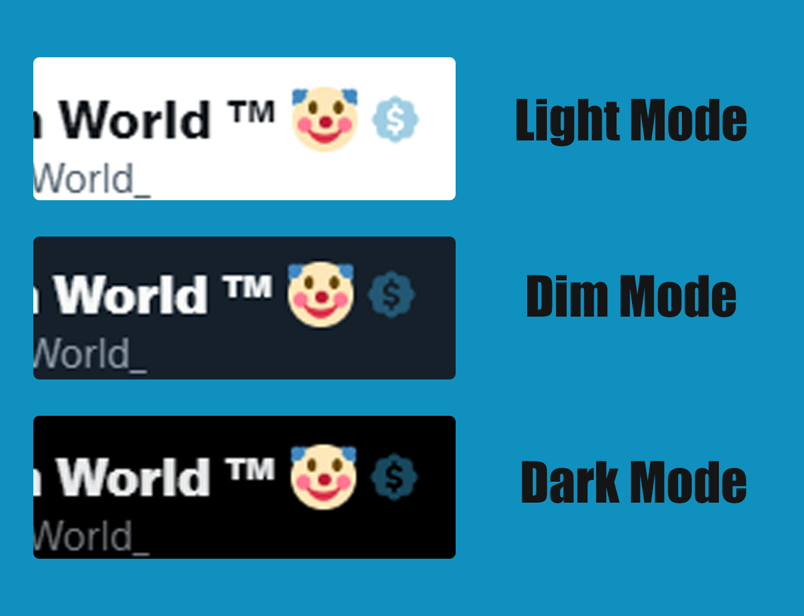

  

<h3 align="center">Twitter Real Verified</h3>

  Identify which users are actually verified from those who have purchased a subscription (Twitter Blue subscription)

<table cellspacing="0" cellpadding="0" align="center">
  <tr>
    <td valign="center">
      <a href="https://addons.mozilla.org/es/firefox/addon/twitter-real-verified/">
        
        
Firefox Add-ons

      </a>
    </td>
        <td valign="center">
      <a href="https://microsoftedge.microsoft.com/addons/detail/twitter-real-verified/llkfeengcmnpbpcgmchgjcjmfoekedij">
        
        
Edge Extension

      </a>
    </td>
  </tr>
</table>

## 👀 Overview - Screenshots

Recognition in themes            |  Identification in the timeline
:-------------------------:|:-------------------------:
  |  

  

## :bulb: Can I contribute
OfCourse! You can open a new issue or pull request with a new improvement or fix bugs.
