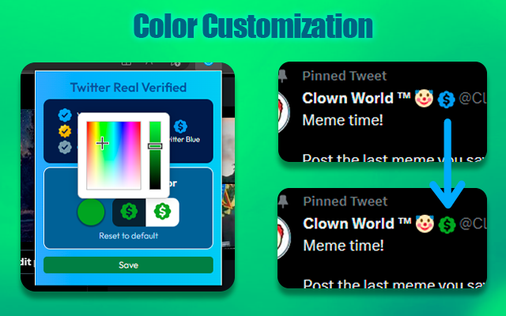
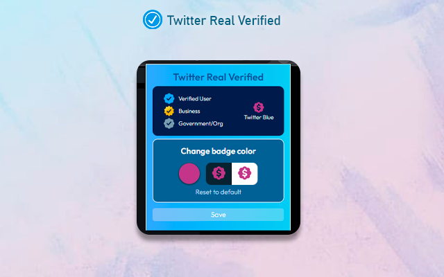

<p align="center">
  
</p>
<h3 align="center">Twitter Real Verified v2.1.7</h3>
<p align="center">
A browser extension that brings back Twitter's legacy verification and distinguishes Twitter Blue users vs legacy verified users. 
</p>
<table cellspacing="0" cellpadding="0" align="center">
  <tr>
    <td valign="center">
      <a href="https://addons.mozilla.org/en/firefox/addon/twitter-real-verified/">
        
        <p align="center">Firefox :green_circle: Available</p>
      </a>
    </td>
        <td valign="center">
      <a href="https://chrome.google.com/webstore/detail/twitter-real-verified/jgpfnkhpecliocnopchaoogpmnejlghn">
        
        <p align="center">Chrome :green_circle: Available</p>
      </a>
    </td>
  </tr>
</table>
<p align="center">

## Overview
<p>Installing this add-on will restore all the legacy verified badges that were removed due to Twitter Blue changes on April 20, 2023.</p>
<p>The list of legacy verified users was taken before April 4, 2023. Thanks to the data collected by <a href="https://twitter.com/travisbrown/status/1649129052479844363">Travisbrown</a>. You can find the complete list on: <a href="https://gist.github.com/travisbrown/b50d6745298cccd6b1f4697e4ec22103">Twitter accounts with legacy verification</a>

### Options
- Hide Twitter Blue badges
- Remove the verification badge from users who have Twitter Blue.
- Replace Twitter Blue badges with 🤡
- Add a simple green checkmark to legacy verified accounts.

### Change badge color
- Change the badge color for verified users, Twitter Blue users, and verified users who have Twitter Blue.
  
<p align="center">
  
  
  
</p>

## What's New 
### v2.1.7:
- Fix bug when showing verified badges.

### v2.1.6 
- Fixed minor issue in Chrome Dev: popup's width broken.

Complete logs: <a href="https://github.com/luiserdef/twitter-real-verified/releases">Releases</a>

## Dev
Popup is created with React.
The project uses esbuild.

After cloning the project, do the following:

```bash
 # Install pnpm 
 npm install -g pnpm 
 
 # Install dependencies
 pnpm install 

 # Generate the files for Chrome
 pnpm run build-chrome
 
 # Generate the files for Firefox
 pnpm run build-firefox
 
 # Run and fix linter issues 
 npx standard --fix 
 # If you have the standardjs extension for VSCode, changes are made on save.
```

### Legacy verified List
This extension uses the screenname from the legacy verified list. The use of user IDs is being addressed in the userids branch.

Any suggestions for improvement are welcome.

Data provided by <a href="https://twitter.com/travisbrown/status/1649129052479844363">Travisbrown's </a>

Full list: <a href="https://gist.github.com/travisbrown/b50d6745298cccd6b1f4697e4ec22103">legacy-verified</a>

The verified user list is splitted in two files and has the following format:
```bash
[{
  "key": "u",
  "users": ["username","username2"]
}]

# key: The first character of the username.
# users: An array of all the usernames where the first character matches the "key"

```
You can generate the files by running this python script.

```bash
# Move to the verifiedList folder
cd verifiedList
 
# Run the script
python legacy-verified.py
```
You have to have python installed. The output files are used in ./src

### Test Extension

Load the extension on Chrome or Edge:

- Access edge://extensions/ or chrome://extensions/
- Check Developer mode
- Click on Load unpacked extension
- Select the folder: chrome-extension.

Load the extension on Firefox

- Open the about:debugging page
- Click the This Firefox option
- Click the Load Temporary Add-on button
- Select any file in the folder firefox-extension

## :bulb: Can I contribute?
Of course! You can open a new issue, or a pull request with a new improvement, or fix bugs.
